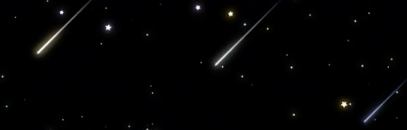

# hlin0495_9103_major_project

Drawing inspiration from Pacita Abad's "Wheels of Fortune," this animated artwork is built upon a collaborative effort of our group code, incorporating various elements to create an engaging visual and auditory experience. It features coloured circles that pulsate and grow in response to the amplitude of an audio file, accompanied by white dots that move across the screen, leaving trails behind them. Below are the instructions on how to interact with the artwork, as well as details of individual approaches to animating the group code.

## Instructions

1. **Play/Pause Interaction**: Click the "Play/Pause" button to start or pause the music and animation.
2. **Volume Control**: Move the mouse vertically to adjust the volume of the audio. The higher the mouse position, the higher the volume and vice versa. 
3. **Panning Control**: Move the mouse horizontally to control the panning of the audio. The further left or right, the more the audio will be panned to that respective side.
4. **Mouse Control**: Move the mouse across the screen to observe changes in white dots' position.

## Individual Approach to animating the group code

### Chosen Method:
Audio - Use the level or frequency content of an audio track to animate the artwork.

### Animated Properties:
- Colored Circles: The colored circles consist of three concentric circles with different colors. Their sizes are animated based on the audio amplitude, creating a pulsating and growing effect. When the amplitude is high, the circles grow in size. When the amplitude is low, the circles shrink. This animation is achieved using the sin function and mapping the amplitude values to a scaling factor.

- White Dots Movement: The white dots move across the screen, following the mouse position with a slight randomness added to their movement. They leave trails behind them, creating a meteor effect. The size of the white dots is also influenced by the audio amplitude, scaling their size accordingly.

### Inspiration:
- Initially, I had the white dots in the background growing and shrinking like the large colored circles, but the entire screen felt too overwhelming. Inspired by the dark purple background and white dots, which reminded me of a galaxy, I transformed the white dots into meteors with tails. These meteors follow the mouse direction when users adjust the volume and panning, creating an interactive effect to the experience.

    

- The colored circles we created for our group assignments remind me of speakers. When music plays, speakers vibrate, as shown in this [YouTube Video](https://youtu.be/njxbQtKKlME?si=sUpTYFG1i35hMXDc&t=5). This inspired me to add a growing and shrinking effect to the circles, simulating the movement of vibrating speakers.

### Technical Explanation:
The animation is powered by the p5.js library, which provides a straightforward way to create interactive and dynamic visualizations. The `preload` function loads the audio file, and the `setup` function initializes the canvas, creates the colored circles, and spawns the white dots.

***Audio Volume:***

The volume of the audio is controlled by the vertical position of the mouse on the canvas. The `mouseMoved` function is called whenever the mouse moves, and it maps the mouse's vertical position (`mouseY`) to a range between 0 and 1 using the `map` function. This mapped value is then assigned to the `volume` variable, which is used to set the volume of the audio using the `song.setVolume(volume)` method.

***Audio Panning***

The panning (left-right balance) of the audio is controlled by the horizontal position of the mouse on the canvas. Similar to the volume control, the `mouseMoved` function maps the mouse's horizontal position (`mouseX`) to a range between -1 and 1 using the `map` function. This mapped value is assigned to the pan variable, which is then used to set the panning of the audio using the `song.pan(pan)` method. A value of -1 pans the audio fully to the left, while a value of 1 pans it fully to the right.

***Audio Playback***

The `play_pause` function is responsible for starting and stopping the audio playback. It toggles the `isPlaying` variable, which is used to determine whether the audio should be played or not. When `isPlaying` is true, the `song.loop()` method is called to start playing the audio file in a loop. When `isPlaying` is false, the `song.stop()` method is called to stop the audio playback.

***Visual Aspect***

The `ColoredCircle` class represents the colored circles, handling their positions, radius, and colors. The `draw` method of this class renders the concentric circles, scaling their sizes based on the audio amplitude using the `getAnimationScale` method.

The `WhiteDot` class manages the white dots, updating their positions based on the mouse position and applying collision avoidance with other dots. The draw method of this class renders the white dots as circles and draws their trails using the recorded positions in the `trail` array.

## Changes to Group Code

- Integration of white dots movement and meteor effect, to enhance visual diversity and engagement.

   
